# Lab 3: Dynamics on and of Network

> Author: Haolin Li (haolinli@umich.edu)
>
> Last Updated: 3/7/2024
>
> Instruction Link: https://epimath.org/cscs-530-materials/Labs/Lab3.html
>
> Course Repository: https://github.com/humblepasty/complex-modelling


## Problem 1: Exploring the SIR mean-field model

### Problem 1A

The average degree of an Erdos-Renyi network with $N$ nodes and edge probability $p_e$:

For each node, # of possible edges it can have:
$$
(N-1)
$$
With the probabilistic of $p_e$ that this edge exists, the expected # of edges for this node is:
$$
p_e(N-1)
$$
Thus the mean degree:
$$
<k> = p_e(N-1)
$$


### Problem 1B

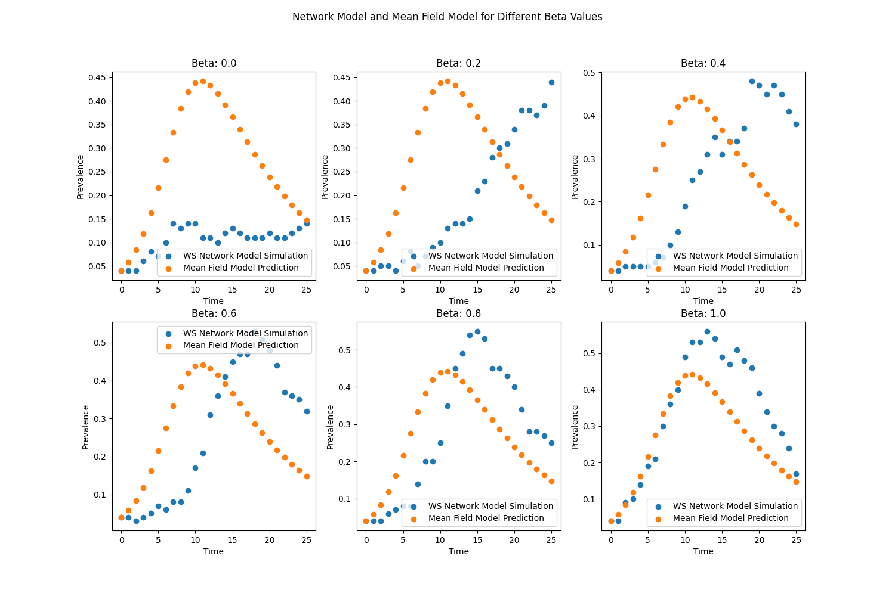

The mean field prediction model stays the same when beta changes.

But as beta increases, the simulation result by the WS network gets closer to the predicted values, with the prevalence rising more and more quickly at the earlier stages.


### Problem 1C

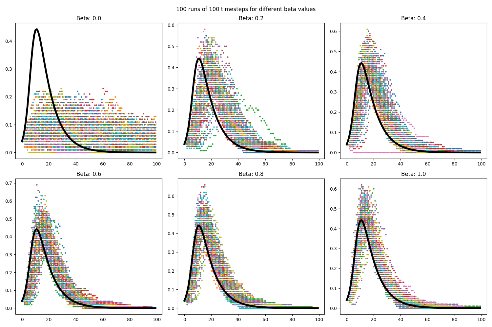


### Problem 1D

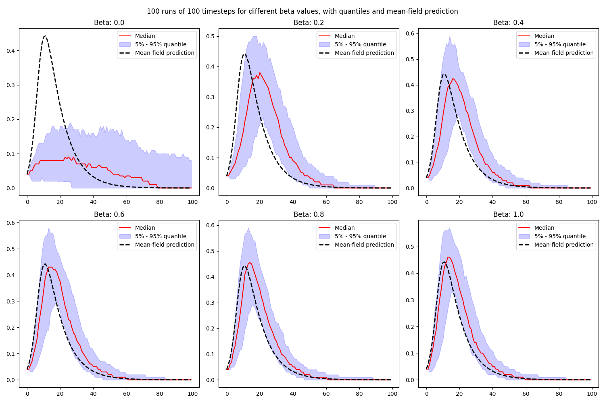

When beta is low, the mean field model based on Erdos-Renyi network cannot represent the dynamics. As shown in the first subplot, the simulation result (black dotted line) differs a lot from the 5%-95% quantile belt.

As beta increases, the simulated result gets more similar to the mean field prediction.

Thus for small world networks with smaller beta values, using the mean field model to predict the dynamic would not be accurate. But with larger beta values (for example higher than `0.8`), the prediction would get more accurate.


### Problem 1E

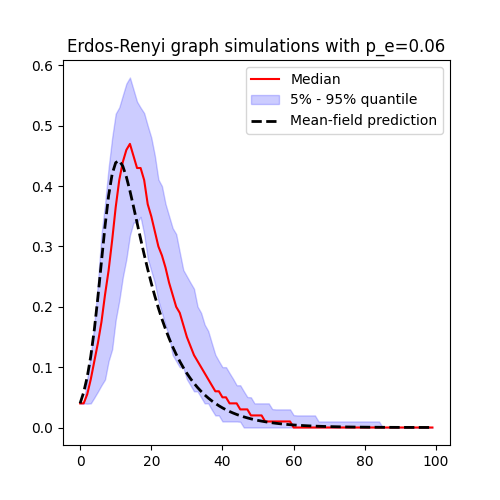

We can observe from the two plots that the relative positions of the mean field prediction line (black dotted line) and the simulation belt (purple) for Erdos-Renyi network is highly similar to that of the Watts-Strogatz network when beta is 1.

Thus the mean field model can well capture the model behaviour for the most random Watts-Strogatz network.


### Code Used in Problem 1

```python
import matplotlib.pyplot as plt
from pylab import *
from IPython import display
import networkx as nx
import numpy as np
from copy import copy, deepcopy
import time

N = 100  # 100 #200  #1000

p_e = 0.06  # probability of edge generation (connection between two people)
p_i = 0.1  # 0.5 # infection probability per contact
p_r = 0.1  # recovery probability
beta = 0.8  # set to 0.5 for now

R0 = (N - 1) * p_e * p_i / p_r
# print(R0)

prev = []  # prevalence (total infected nodes/total nodes) in the network model
prev_mf = []  # prevalence (total infected nodes/total nodes) in the mean field model
susc_mf = []  # fraction of nodes that are susceptible in the mean field model


def initialize():
    global g, nextg, prev, prev_mf, susc_mf

    # Initialize network model
    prev = []
    prev_mf = []
    susc_mf = []

    # generate graph using watts_strogatz_graph
    g = nx.watts_strogatz_graph(N, round((p_e * (N - 1))), beta)  # start with a WS graph
    # g = nx.erdos_renyi_graph(N, p_e)  # start with an ER graph
    g.pos = nx.circular_layout(g)  # set the positions of the nodes (for plotting
    nx.set_node_attributes(g, 0, 'state')  # everyone starts off susceptible
    g.nodes[1]['state'] = 1  # set one node to be infected (index case)
    g.nodes[2]['state'] = 1
    g.nodes[3]['state'] = 1
    g.nodes[4]['state'] = 1
    nextg = g.copy()
    nextg.pos = g.pos
    prev.append(4 / len(g.nodes))  # initial prevalence in the real graph

    # Initialize mean field model
    susc_mf.append((N - 4) / N)  # initial susceptible fraction in the mean field model
    prev_mf.append(4 / N)  # initial prevalence in the mean field model


def update():
    global g, nextg, prev, prev_mf, susc_mf

    # Update network model
    curprev = 0
    nextg = g.copy()
    nextg.pos = g.pos
    for a in g.nodes:
        if g.nodes[a]['state'] == 0:  # if susceptible
            nextg.nodes[a]['state'] = 0
            for b in g.neighbors(a):
                if g.nodes[b]['state'] == 1:  # if neighbor b is infected
                    if random() < p_i:
                        nextg.nodes[a]['state'] = 1
        elif g.nodes[a]['state'] == 1:  # if infected
            curprev += 1
            nextg.nodes[a]['state'] = 2 if random() < p_r else 1
    prev.append(curprev / len(g.nodes()))  # prevalence in the real graph
    g = nextg.copy()
    g.pos = nextg.pos

    # Update mean field model
    susc_mf.append(susc_mf[-1] - (N - 1) * p_e * p_i * prev_mf[-1] * susc_mf[-1])
    prev_mf.append(prev_mf[-1] + (N - 1) * p_e * p_i * prev_mf[-1] * susc_mf[-1] - p_r * prev_mf[-1])


def observe():  # visualize the network
    global g, prev, prev_mf, susc_mf
    cla()
    nx.draw(g, cmap=cm.plasma, vmin=0, vmax=2,
            node_color=[g.nodes[i]['state'] for i in g.nodes],
            pos=g.pos)


# initialize()
# update()
# observe()
# plt.show()
#
# prev = []  # prevalence (total infected nodes/total nodes) in the network model
# prev_mf = []  # prevalence (total infected nodes/total nodes) in the mean field model
# susc_mf = []  # fraction of nodes that are susceptible in the mean field model
#
# initialize()
# for i in range(25):
#     update()
#     observe()
#     display.clear_output(wait=True)
#     display.display(gcf())
#     time.sleep(0.5)
#
# # plot the prevalence over time
# clf()
# epicurve = scatter(range(len(prev)), prev)
# scatter(range(len(prev_mf)), prev_mf)
# xlabel("Time")
# ylabel("Prevalence")
# # add a legend
# legend(["WS Network Model Simulation", "Mean Field Model Prediction"])
# plt.show()


# simulate the process with different beta values
beta_values = np.linspace(0, 1, 6)  # the bate values to simulate


def beta_comparison(beta_values):
    global beta, prev, prev_mf, susc_mf
    plt.figure(figsize=(15, 10))
    for index, b in enumerate(beta_values):
        beta = b
        initialize()

        for i in range(25):
            update()
            # observe()
            # display.clear_output(wait=True)
            # display.display(gcf())
            # time.sleep(0.5)
        subplot(2, 3, index + 1)
        epicurve = scatter(range(len(prev)), prev)
        scatter(range(len(prev_mf)), prev_mf)
        xlabel("Time")
        ylabel("Prevalence")
        title("Beta: " + str(round(b, 1)))
        legend(["WS Network Model Simulation", "Mean Field Model Prediction"])

    # plt.tight_layout()
    plt.suptitle("Network Model and Mean Field Model for Different Beta Values")
    plt.show()


# simulate the process with different beta values
# beta_comparison(beta_values)

# problem 1c

beta_values = np.linspace(0, 1, 6)  # the bate values to simulate


def beta_longer_sim(beta_values):
    global beta, prev, prev_mf, susc_mf
    timesteps = 100
    numruns = 100
    plt.figure(figsize=(15, 10))
    for index, b in enumerate(beta_values):
        beta = b
        prevarray = np.zeros([timesteps, numruns])
        plt.subplot(2, 3, index + 1)
        plt.title("Beta: " + str(round(b, 1)))
        initialize()
        for i in range(0, numruns):
            initialize()
            for j in range(1, timesteps):
                update()
            prevarray[:, i] = prev
            scatter(range(timesteps), prev, s=5)
        plot(range(timesteps), prev_mf, 'k', linewidth=4)

    plt.suptitle("100 runs of 100 timesteps for different beta values")
    plt.tight_layout()
    plt.show()


# beta_longer_sim(beta_values)

# problem 1d
def beta_longer_sim_1d(beta_values):
    global beta, prev, prev_mf, susc_mf
    timesteps = 100
    numruns = 100
    plt.figure(figsize=(15, 10))
    for index, b in enumerate(beta_values):
        beta = b
        prevarray = np.zeros([timesteps, numruns])
        plt.subplot(2, 3, index + 1)
        plt.title("Beta: " + str(round(b, 1)))
        initialize()
        for i in range(0, numruns):
            initialize()
            for j in range(1, timesteps):
                update()
            prevarray[:, i] = prev

        # Calculate median, 5% and 95% quantiles for each timestep
        median = np.median(prevarray, axis=1)
        quantile_5 = np.quantile(prevarray, 0.05, axis=1)
        quantile_95 = np.quantile(prevarray, 0.95, axis=1)

        # Plotting
        time_range = range(timesteps)
        plt.plot(time_range, median, 'r-', label='Median')
        plt.fill_between(time_range, quantile_5, quantile_95, color='blue', alpha=0.2, label='5% - 95% quantile')
        plt.plot(time_range, prev_mf, 'k--', linewidth=2, label='Mean-field prediction')

        plt.legend()

    plt.suptitle("100 runs of 100 timesteps for different beta values, with quantiles and mean-field prediction")
    plt.tight_layout()
    plt.show()


# beta_longer_sim_1d(beta_values)

# problem 1e
timesteps = 100
numruns = 100
plt.figure(figsize=(5, 5))
prevarray = np.zeros([timesteps, numruns])
plt.title("Erdos-Renyi graph simulations with p_e=0.06")
prev = []
prev_mf = []
susc_mf = []

# generate graph using watts_strogatz_graph
g = nx.erdos_renyi_graph(N, 0.06)
g.pos = nx.circular_layout(g)  # set the positions of the nodes (for plotting
nx.set_node_attributes(g, 0, 'state')  # everyone starts off susceptible
g.nodes[1]['state'] = 1  # set one node to be infected (index case)
g.nodes[2]['state'] = 1
g.nodes[3]['state'] = 1
g.nodes[4]['state'] = 1
nextg = g.copy()
nextg.pos = g.pos
prev.append(4 / len(g.nodes))  # initial prevalence in the real graph

# Initialize mean field model
susc_mf.append((N - 4) / N)  # initial susceptible fraction in the mean field model
prev_mf.append(4 / N)  # initial prevalence in the mean field model

for i in range(0, numruns):
    initialize()
    for j in range(1, timesteps):
        update()
    prevarray[:, i] = prev

# Calculate median, 5% and 95% quantiles for each timestep
median = np.median(prevarray, axis=1)
quantile_5 = np.quantile(prevarray, 0.05, axis=1)
quantile_95 = np.quantile(prevarray, 0.95, axis=1)

# Plotting
time_range = range(timesteps)
plt.plot(time_range, median, 'r-', label='Median')
plt.fill_between(time_range, quantile_5, quantile_95, color='blue', alpha=0.2, label='5% - 95% quantile')
plt.plot(time_range, prev_mf, 'k--', linewidth=2, label='Mean-field prediction')

plt.legend()
plt.show()
```


## Problem 2

### Problem 2A

Simulation with no failure node:

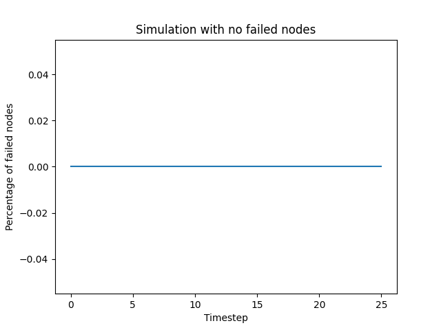

Final network status:

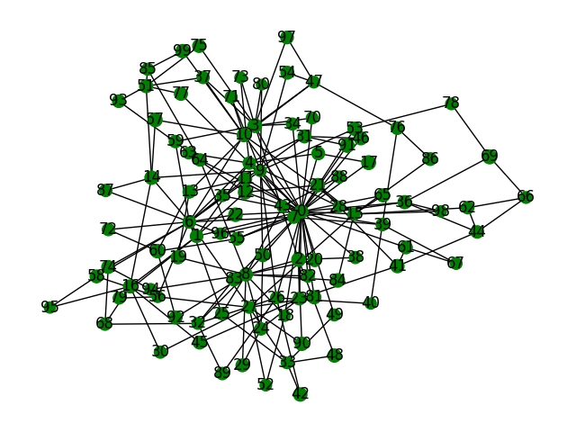

Simulation with one failure node:

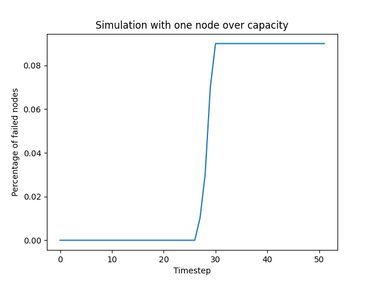

Final network status:

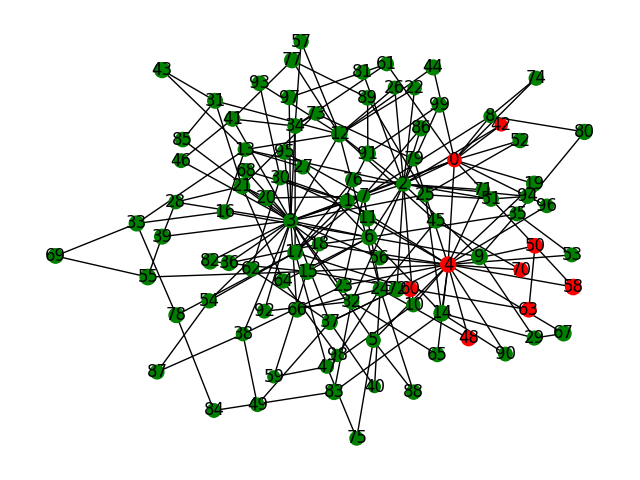


### Problem 2B

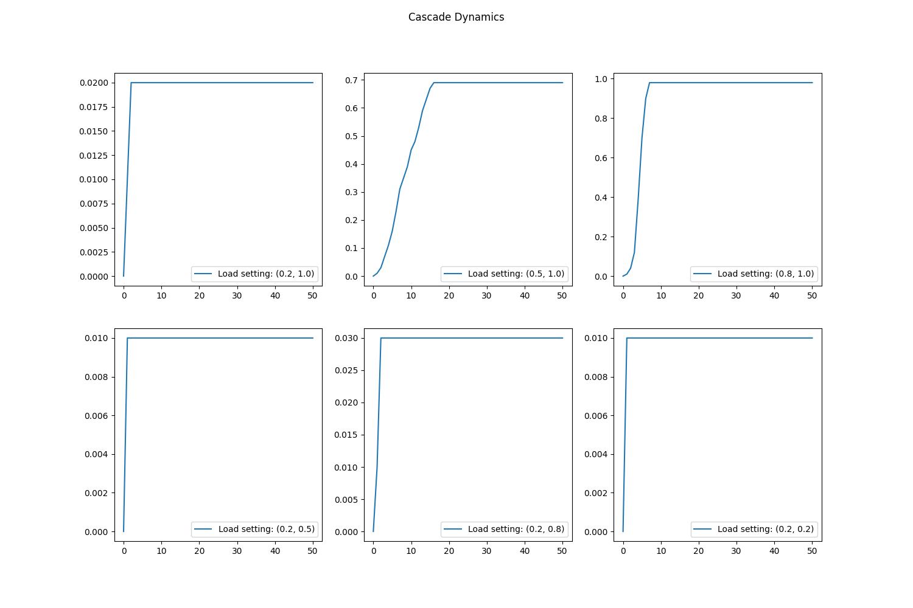

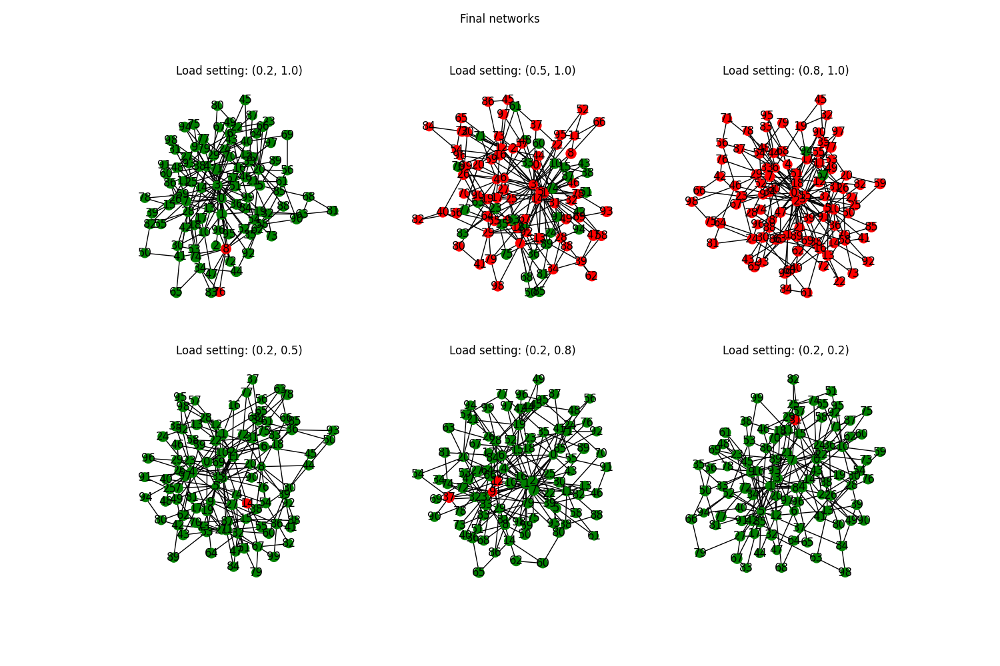

Comparing the three situations from the first row, we can observe that as the load ranges closer from the maximum capacity, the failure size and frequency of the stabilized stage is increasing. 


### Problem 2C

Power Grid Network, Spectral Layout

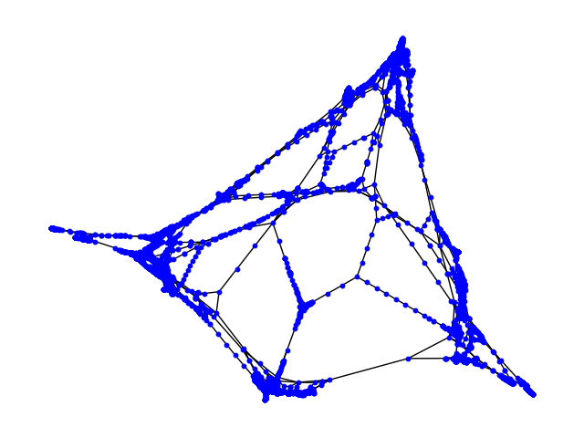

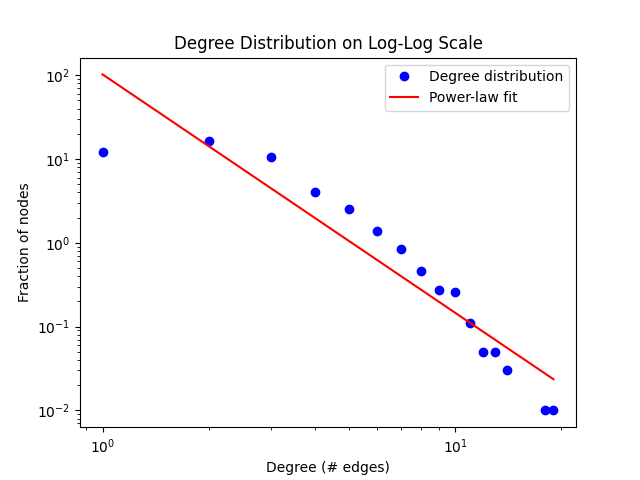

- It would be hard to directly compare the network structure with different layouts. Switching the layout to spectral for a generated network:

  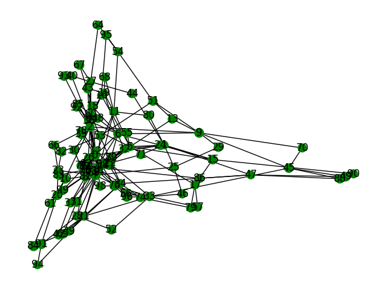

- we can notice that for the real world network, there seems to be less edges

- According to the degree distribution plot, the real world network follows the power-law (scale free), but have less nodes with 0 or 1 nodes. Which makes sense because the power station is usually connect to at least one other node.


### Problem 2D

20 simulations on the real world model:

percentages of the fail nodes:

```
[0.1916616069621534, 0.060514065978546853, 0.24367536935842946, 0.13357619914996965, 0.021250758955676987, 0.010321797207043109, 0.31066585711394457, 0.0010119409026512851, 0.0020238818053025702, 0.008905079943331309, 0.14592187816231533, 0.0008095527221210282, 0.0030358227079538553, 0.19328071240639547, 0.06982392228293868, 0.008297915401740538, 0.15846994535519127, 0.0008095527221210282, 0.09451528030763004, 0.002226269985832827]
```

Histogram:

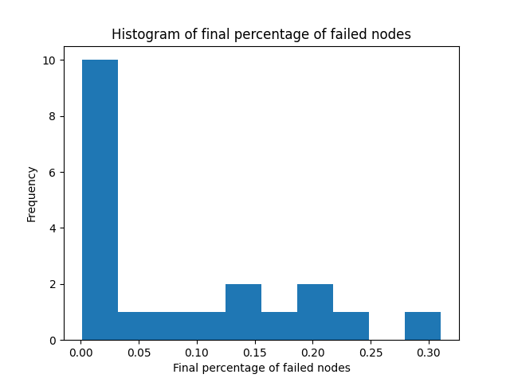

We can see from the plot that:

- About 40% of the simulations do more than 10% of the fail
- No simulation shows a complete fail percentage. This network is somewhat robust against random failure (one failure at a time).


### Code Used in Problem 2

```python
import matplotlib.pyplot as plt
import pylab as plb
from IPython import display
import networkx as nx
import numpy as np
from copy import copy, deepcopy
import time

# generate the graph
N = 100
m = 2

pct_failed = []


def initialize(load_min, load_max):
    global g, pct_failed

    # generate graph using barabasi_albert_graph
    g = nx.barabasi_albert_graph(N, m)
    # g.pos = nx.spring_layout(g)  # set the positions of the nodes (for plotting
    g.pos = nx.spectral_layout(g)  # set the positions of the nodes (for plotting
    nextg = g.copy()
    nextg.pos = g.pos

    # capacity with normal distribution of mean 100, standard deviation 10
    nx.set_node_attributes(g, 0, 'capacity')
    for a in g.nodes:
        g.nodes[a]['capacity'] = np.random.normal(100, 10)

    # electicity load random from 0.2 to 1.0 of capacity
    nx.set_node_attributes(g, 0, 'load')
    for a in g.nodes:
        g.nodes[a]['load'] = np.random.uniform(load_min, load_max) * g.nodes[a]['capacity']

    # opreational status
    nx.set_node_attributes(g, 'running', 'status')

    # attributes for plot
    pct_failed = []
    pct_failed.append(0)


def update():
    global g, nextg, prev, prev_mf, susc_mf

    # Update network model
    nextg = g.copy()
    nextg.pos = g.pos
    for a in g.nodes:
        if g.nodes[a]['status'] == 'running':
            if g.nodes[a]['load'] > g.nodes[a]['capacity']:
                nextg.nodes[a]['status'] = 'failed'
                # evenly distribute the load to the neighbors
                for b in g.neighbors(a):
                    nextg.nodes[b]['load'] += g.nodes[a]['load'] / len(list(g.neighbors(a)))
            else:
                nextg.nodes[a]['status'] = 'running'
        elif g.nodes[a]['status'] == 'failed':
            nextg.nodes[a]['status'] = 'failed'
    g = nextg.copy()
    g.pos = nextg.pos

    pct_failed.append(len([n for n in g.nodes if g.nodes[n]['status'] == 'failed']) / len(g.nodes))


def observe():
    global g, nextg, prev, prev_mf, susc_mf

    # Plot the graph
    # plb.clf()
    # color the nodes according to their status
    color_map = []
    for node in g:
        if g.nodes[node]['status'] == 'running':
            color_map.append('green')
        else:
            color_map.append('red')
    # adjust the size of the node according to the capacity
    node_size = []
    for node in g:
        node_size.append(g.nodes[node]['capacity'])
    nx.draw(g, pos=g.pos, node_color=color_map, with_labels=True, node_size=node_size)
    # plb.show()


# problem 2a

# start the simulation with no failed nodes
# initialize(0.2, 1.0)
# for i in range(25):
#     update()
# #     observe()
# #     time.sleep(0.5)
# #     display.clear_output(wait=True)
#
# observe()
# plt.show()
#
# plb.plot(pct_failed)
# plb.xlabel('Timestep')
# plb.ylabel('Percentage of failed nodes')
# plb.title('Simulation with no failed nodes')
# plb.show()
#
#
# # start with one node over capacity
# initialize(0.2, 1.0)
#
# # an example of a specific node
# # g.nodes[2]['load'] = g.nodes[2]['capacity'] + 1
#
# # set a random node to hold more load than its capacity
# failed_node = np.random.choice(g.nodes, 1)
# g.nodes[failed_node[0]]['load'] = g.nodes[failed_node[0]]['capacity'] + 1
#
# timestep = 50
# for i in range(25):
#     update()
#     # observe()
#     # time.sleep(0.5)
#     # display.clear_output(wait=True)
#
# observe()
#
# # plot the percentage of failed nodes over time
# plb.plot(pct_failed)
# plb.xlabel('Timestep')
# plb.ylabel('Percentage of failed nodes')
# plb.title('Simulation with one node over capacity')
# plb.show()

# problem 2b

# different load distributions
# load_settings = [(0.2, 1.0), (0.5, 1.0), (0.8, 1.0), (0.2, 0.5), (0.2, 0.8), (0.2, 0.2)]
# # two 2 times 3 figures
# final_network = plt.figure(figsize=(15, 10))
# # title for each figure
# plt.suptitle('Final networks')
# cascade = plt.figure(figsize=(15, 10))
# plt.suptitle('Cascade Dynamics')
#
# for index, load_setting in enumerate(load_settings):
#     initialize(load_setting[0], load_setting[1])
#     failed_node = np.random.choice(g.nodes, 1)
#     g.nodes[failed_node[0]]['load'] = g.nodes[failed_node[0]]['capacity'] + 1
#
#     for i in range(50):
#         update()
#
#     plt.figure(final_network.number)
#     plt.subplot(2, 3, index + 1)
#     plt.title('Load setting: ' + str(load_setting))
#     observe()
#
#     plt.figure(cascade.number)
#     plt.subplot(2, 3, index + 1)
#     plt.plot(pct_failed, label='Load setting: ' + str(load_setting))
#     plt.legend()
#
# plt.show()

# problem 2c
def initialize_real(load_min, load_max):
    global g, pct_failed

    # generate graph using barabasi_albert_graph
    g = nx.read_gml('power/power.gml', label='id')
    g.pos = nx.spectral_layout(g)  # set the positions of the nodes (for plotting
    nextg = g.copy()
    nextg.pos = g.pos

    # capacity with normal distribution of mean 100, standard deviation 10
    nx.set_node_attributes(g, 0, 'capacity')
    for a in g.nodes:
        g.nodes[a]['capacity'] = np.random.normal(100, 10)

    # electicity load random from 0.2 to 1.0 of capacity
    nx.set_node_attributes(g, 0, 'load')
    for a in g.nodes:
        g.nodes[a]['load'] = np.random.uniform(load_min, load_max) * g.nodes[a]['capacity']

    # opreational status
    nx.set_node_attributes(g, 'running', 'status')

    # attributes for plot
    pct_failed = []
    pct_failed.append(0)

# load network from file
initialize_real(0.5, 1.0)

# plot the network
# plb.clf()
# nx.draw(g, pos=g.pos, node_size=10, node_color='blue')
# plb.title('Power Grid Network, Spectral Layout')
# plb.show()
#
# # plot the degree distribution on a log-log scale
# degrees = [g.degree(n) for n in g.nodes]
# degree_counts = np.unique(degrees, return_counts=True)
#
# # the probability of a node having a certain degree
# degree_probs = degree_counts[1] / N
#
# plt.figure()
# plt.loglog(degree_counts[0], degree_probs, 'b.', markersize=12)
#
# slope, intercept = np.polyfit(np.log(degree_counts[0]), np.log(degree_probs), 1)
# plt.loglog(degree_counts[0], np.exp(intercept) * degree_counts[0] ** slope, 'r-')
#
# plt.legend(['Degree distribution', 'Power-law fit'])
# plt.xlabel('Degree (# edges)')
# plt.ylabel('Fraction of nodes')
# plt.title('Degree Distribution on Log-Log Scale')
#
# plt.show()

# problem 2d
# run 20 simulations with 50 timesteps each
final_failed = []
for i in range(20):
    initialize_real(0.5, 1.0)
    failed_node = np.random.choice(g.nodes, 1)
    g.nodes[failed_node[0]]['load'] = g.nodes[failed_node[0]]['capacity'] + 1

    for j in range(50):
        update()

    # record the final percentage of failed nodes
    final_failed.append(pct_failed[-1])
    print('Simulation', i, 'done')

# plot the histogram of the final percentage of failed nodes
# print in tabular form
print('Final percentage of failed nodes')
print(final_failed)

bins = np.linspace(np.min(final_failed), np.max(final_failed), 11)
plt.hist(final_failed, bins=bins)
plt.xlabel('Final percentage of failed nodes')
plt.ylabel('Frequency')
plt.title('Histogram of final percentage of failed nodes')
plt.show()
```

